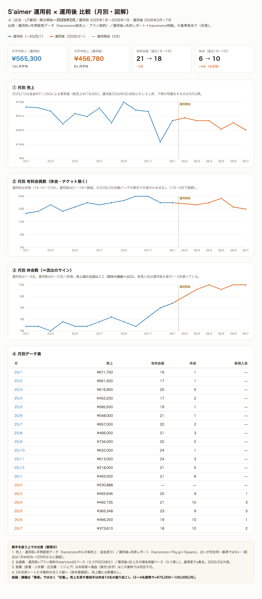

# S'aimer 運用前 × 運用後 比較（鈴木さん報告用）

作成：2026-08-25。**斗（広告・LP運用）の関与開始＝2026年2月**。
- 運用前＝2025年1月〜2026年1月（13ヶ月）
- 運用後＝2026年2月〜7月（6ヶ月）

出典：運用前＝`S'aimer_年間経営データ_2025年1月〜2026年1月.md`（hacomono中心の純売上・プラン契約ベース）／運用後＝決済レポート＋hacomono購入明細。**※後述の「基準の違い」に注意**。

---

## 図解（月別・2025/1〜2026/7）

> 青＝運用前／オレンジ＝運用後／金の点線＝運用開始（2月）。①売上 ②有料会員 ③休会 の3本。
> インタラクティブ版（ホバーで数値表示）は同フォルダの `運用前後比較_図解_20260825.html` をダウンロードしてブラウザで開いてください。

---

## 結論（先に3つ）

1. **数字の見え方：運用後に売上・有料会員とも下降局面に入った**。月平均売上 運用前¥565,300 → 運用後¥456,780。有料会員 直近運用前(2026/1)21名 → 運用後7月18名。
2. **ただし下降の主因は「休会流出（継続＝出口）」で、広告・LP（＝斗の担当＝入口）は機能している**。休会は運用前の1〜6名から運用後9〜10名へ倍増。一方で**新規入会は運用後も毎月1〜3名continuing**。
3. **つまり課題は「集客」ではなく「定着（休会掘り起こし）」**。売上を戻す最短手は新規を増やすことより、眠っている休会10名の復帰。

---

## ① 月平均売上の比較

| 期間 | 月平均（純）売上 | 備考 |
|---|---:|---|
| 運用前（2025/1〜2026/1・13ヶ月） | **¥565,300** | 2025/12は返金¥311,250で¥218,000の異常月。除くと約¥603,000 |
| 運用後（2026/2〜7・6ヶ月） | **¥456,780** | — |

**直近を月単位でつなぐと（下降のタイミング）：**
| 2026/1（運用前ラスト） | 2月 | 3月 | 4月 | 5月 | 6月 | 7月 |
|---:|---:|---:|---:|---:|---:|---:|
| ¥493,000 | ¥530,888 | ¥493,646 | ¥492,735 | ¥383,348 | ¥466,250 | ¥373,810 |

- 運用開始直後の**2月は¥530,888と むしろ上昇**（1月¥493kから）。**下降が明確になるのは5月以降**。

## ② 有料会員数の比較（休会・チケット除く）

| 期間 | 有料会員 | 休会 |
|---|---:|---:|
| 運用前 2025/1 | 16 | 1 |
| 運用前 ピーク 2025/10-11 | **24** | 1〜3 |
| 運用前 直近 2026/1 | 21 | 6 |
| 運用後 3月 | 20 | 9 |
| 運用後 5月（運用後ピーク） | 23 | 9 |
| 運用後 7月 | **18** | 10 |

- 運用前は**成長フェーズ**（全体会員 23名→42名／有料16→21、+83%）。
- 運用後は**有料会員が微減（21→18）、休会が6→10へ増加**。運用後5月に有料23まで戻す局面もあったが、7月の休会ウェーブで18へ。

## ③ 下降の中身（＝なぜ広告のせいではないか）

- **新規入会は運用後も毎月立っている**：3月 濱田／4月 安達・藤野・高橋／5月 五十嵐・宮近・船津丸／6月 白井／7月 香川・中嶋。→ **入口（広告・LP）は動いている**。
- **失っているのは既存の継続**：7月に休会10名ウェーブ（三俣・仲宗根・堀江・宮近・尼崎・山下・福田・秋野(妊娠)・立花・門前ほか）。理由は秋野さん(妊娠)以外ほぼ不明。
- パターンは「退会（ハード）」ではなく「休会・チケットへのダウングレード（サイレント）」が主＝**関係は切れておらず、復帰余地が大きい**。

## ④ 打ち手（結論の裏返し）

- **最優先＝休会10名の掘り起こし**。3〜4名復帰で +¥75,000〜100,000/月（直近の落ち込みをほぼ取り戻す規模）。
- そのために必要な唯一の欠けピース＝**「休会理由」**。さとみさんへヒアリング（①各人の理由 ②復帰見込み ③きっかけがあれば戻るか）。
- 広告・LP側は継続改善中（8月に追従CTA改修・LP2b FV刷新・新クリエ投入）。**入口は維持しつつ、出口対策を最優先に置く**のが正しい配分。

---

## ★基準の違い（数字を扱う上での注意・要開示）

鈴木さんに出す際、以下の基準差を必ず添える（同一定義での厳密比較ではない）：

1. **売上**：運用前＝年間経営データ（hacomono中心の純売上・返金差引）／運用後＝決済レポート（hacomono＋Pay.jp＋Square）。近いが完全同一基準ではない。直近が滑らかに繋がる（1月¥493k→2月¥531k）ので実用上の連続性はある。
2. **会員数**：運用前＝プラン契約のstart/end日ベース（セミプライベートP0003含む）／運用後＝計上月の課金明細ベース（セミ無し）。基準差で±数名の誤差あり。
3. **経費は未取得**（家賃・人件費・広告費・リジョブ）。損益（黒字/赤字）はこの資料では判定不可。広告費・リジョブはこちらで補完可能、家賃・人件費は原田様側の数字が必要。
4. 3月の決済シートに手数料の式ミス疑い（原本要確認）。売上額そのものには影響なし。

関連：[[売上まとめ_2月-7月_20260825]]／[[会員数増減_調査_20260722]]
